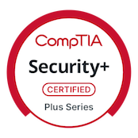
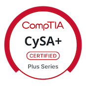
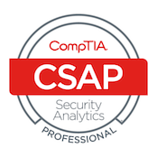

## Hi, I'm Jaquion Richardson

**Security+ Certified | CySA+ Certified | CSAP | Aspiring SOC Analyst | Cybersecurity Home Lab Builder**

I am building hands-on cybersecurity experience through practical blue-team, Windows, Linux, Active Directory, SIEM, log analysis, and digital forensics projects. My goal is to move into SOC Analyst, cybersecurity analyst, IAM, Linux administration, or IT support roles where I can apply investigation, documentation, troubleshooting, and security operations skills.

I use this GitHub profile to document the projects I have completed, the tools I have worked with, and the security concepts I am practicing.

---

## Cybersecurity Projects

### SIEM and Detection Engineering

- [Home Lab SIEM Deployment with Wazuh, Sysmon, and Custom Windows Detection Rules](projects/wazuh-sysmon-siem-lab.md)  
  Built a Wazuh SIEM server on Ubuntu, onboarded a Windows VM with the Wazuh agent, integrated Sysmon Event ID 1 process creation logs, and created a custom XML detection rule to alert on `whoami.exe` reconnaissance activity.

### Windows and Active Directory

- [Active Directory Home Lab with Windows Server and Domain-Joined Client](projects/active-directory-home-lab.md)  
  Built a small enterprise-style Windows domain environment using Windows Server, Active Directory Domain Services, DNS, DHCP, routing/NAT, PowerShell user creation, and a domain-joined Windows client.

- [SMB Brute Force Detection Lab Using Kali and Windows Security Logs](projects/smb-brute-force-detection.md)  
  Simulated SMB password guessing from Kali against a Windows VM and analyzed Windows Security Event IDs 4625 and 4624 to identify failed logons, successful authentication, Logon Type 3, source IP activity, and targeted accounts.

### Linux and Web Server Security

- [Apache Web Server Deployment and Directory Enumeration Log Analysis](projects/apache-web-log-analysis.md)  
  Deployed Apache on Ubuntu Server, generated controlled directory enumeration traffic from Kali, and analyzed Apache access logs for repeated HTTP GET requests, 404 responses, source IP activity, and web reconnaissance patterns.

- [Linux Deleted File Recovery Lab](projects/linux-deleted-file-recovery.md)  
  Practiced Linux file deletion and recovery concepts using terminal-based tools and documented how deleted file recovery depends on filesystem behavior, disk activity, and preservation of evidence.

### Digital Forensics and Incident Response

- [Windows Deleted File Recovery and Forensic Imaging Lab](projects/windows-deleted-file-recovery.md)  
  Created a Windows forensic recovery lab using a secondary VirtualBox disk, deleted test files, preserved a copy of the evidence disk, and recovered deleted files using FTK Imager while documenting evidence preservation concepts.

### Networking and Remote Access

- [Android Termux SSH Remote Access Lab](projects/android-termux-ssh-lab.md)  
  Configured SSH access into an Android device using Termux and OpenSSH, connected from Kali over a local network, and practiced remote shell access and secure file transfer using SCP.

---

## Skills Practiced

- SIEM deployment and alert validation
- Wazuh manager, dashboard, and Windows agent configuration
- Sysmon installation and Windows process creation telemetry
- Custom Wazuh XML rule creation
- Windows Event Log analysis
- Sysmon Event ID 1 process creation analysis
- Security Event IDs 4624 and 4625
- Active Directory, DNS, DHCP, and domain-joined clients
- SMB authentication investigation
- Apache web server log analysis
- Linux command-line investigation
- Digital forensics and deleted file recovery
- FTK Imager evidence review
- VirtualBox home lab networking
- SSH and SCP remote access
- Incident documentation and portfolio reporting

---

## Tools and Technologies

- Wazuh
- Sysmon
- Windows Event Viewer
- Windows Server
- Active Directory
- PowerShell
- Kali Linux
- Ubuntu Server
- Apache
- FTK Imager
- VirtualBox
- SSH / SCP
- Termux
- Wireshark
- Nmap
- Hydra
- Linux CLI tools

---

## Certifications

<table>
  <tr>
    <td align="center">
      
       
      <strong>CompTIA Security+</strong>
       
      <a href="https://www.credly.com/badges/b03d5e8e-cb94-4ce2-a406-451c9aaae24c/public_url">Verify Credential</a>
    </td>
    <td align="center">
      
       
      <strong>CompTIA CySA+</strong>
       
      <a href="https://www.credly.com/badges/6697b9da-7971-44bc-b3e8-3968905c5625/public_url">Verify Credential</a>
    </td>
    <td align="center">
      
       
      <strong>CompTIA CSAP</strong>
       
      <a href="https://www.credly.com/badges/a9d7cd62-d7db-415d-9c8c-8a12ed526a6f/public_url">Verify Credential</a>
    </td>
  </tr>
</table>

---

## Professional Background

My professional background includes customer service, dispute resolution, technical troubleshooting, and business operations. I have experience explaining technical issues clearly, documenting findings, following procedures, and working in environments where accuracy and communication matter.

Experience includes:

- Customer Service Agent, TD Bank
- Customer Service Advocate, Verizon
- Dispute Specialist I, Resurgent Capital Services
- Owner/Operator, Coast2CoastLogix medical courier service

---

## Current Focus

I am continuing to build practical cybersecurity projects focused on:

- SOC analyst workflows
- SIEM alert triage
- Windows and Linux log analysis
- Active Directory security
- Phishing and email security
- Incident reporting
- Threat detection and detection rule tuning

---

## Connect With Me

- LinkedIn: `www.linkedin.com/in/jaquion-richardson-889428349`
- GitHub: `https://github.com/Dreamking33`
